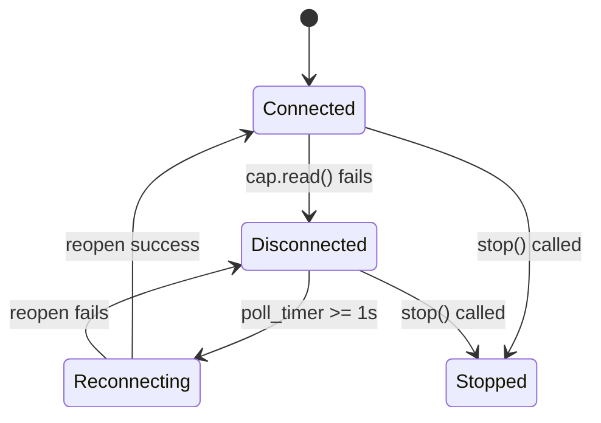

# Camera Disconnection Handling with Auto-Reconnect

## Summary

Implement camera disconnect detection in [backend/camera.py](backend/camera.py) with:

- Automatic reconnection polling (1 second intervals)
- Clean feed cutoff and OCR freeze on disconnect
- Timestamped logging for disconnect/reconnect events

## Architecture




## Changes to `CameraCapture` class

### 1. Add disconnection state tracking

```python
# New instance variables in __init__
self.disconnected = False
self.disconnect_time: Optional[float] = None
self.last_reconnect_attempt: float = 0
```

### 2. Modify `_capture_loop` to detect and handle disconnection

Current behavior: silently ignores read failures, frame stays stale.

New behavior:

- On read failure: set `disconnected = True`, log disconnect time, clear frame to None
- While disconnected: poll every 1 second attempting to reopen camera
- On successful reconnect: log reconnect time, resume normal capture

Key code pattern:

```python
def _capture_loop(self):
    while self.running:
        if self.disconnected:
            # Poll for reconnection (1 second interval)
            if time.time() - self.last_reconnect_attempt >= 1.0:
                self.last_reconnect_attempt = time.time()
                if self._try_reconnect():
                    # Log reconnection with timestamp
                    print(f"[Camera #{self.camera_index}] Reconnected at {datetime.now().isoformat()}")
                    self.disconnected = False
            time.sleep(0.1)
            continue
            
        ret, frame = self.cap.read()
        if not ret:
            # Disconnect detected
            self.disconnected = True
            self.disconnect_time = time.time()
            with self.lock:
                self.frame = None  # Clear frame to freeze downstream consumers
            print(f"[Camera #{self.camera_index}] Disconnected at {datetime.now().isoformat()}")
            continue
            
        with self.lock:
            self.frame = frame
        time.sleep(0.01)
```

### 3. Add reconnection helper method

```python
def _try_reconnect(self) -> bool:
    """Attempt to reopen the camera. Returns True on success."""
    if self.cap:
        self.cap.release()
    self.cap = _open_video_capture(self.camera_index)
    if self.cap.isOpened():
        # Restore resolution settings
        _try_set_resolution(self.cap, [...])
        # Test read
        ret, _ = self.cap.read()
        return ret
    return False
```

### 4. Add status method for external queries

```python
def is_disconnected(self) -> bool:
    """Check if camera is currently disconnected."""
    return self.disconnected
```

## Impact on OCR

The existing OCR logic already handles `None` frames gracefully:

- `OCRWorker._ocr_loop()` checks `if frame is not None` before processing
- When camera disconnects, `get_frame()` returns `None`, OCR naturally freezes
- When camera reconnects, frames resume, OCR automatically resumes

No changes needed to [backend/ocr.py](backend/ocr.py).

## Log Output Examples

```
[Camera #0] Disconnected at 2026-02-04T14:32:15.123456
[Camera #0] Reconnected at 2026-02-04T14:32:18.654321
```

